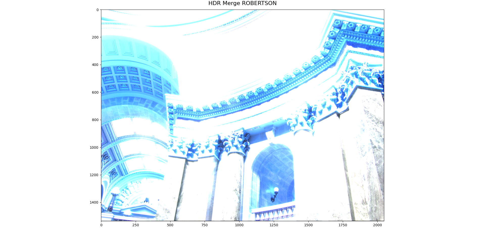
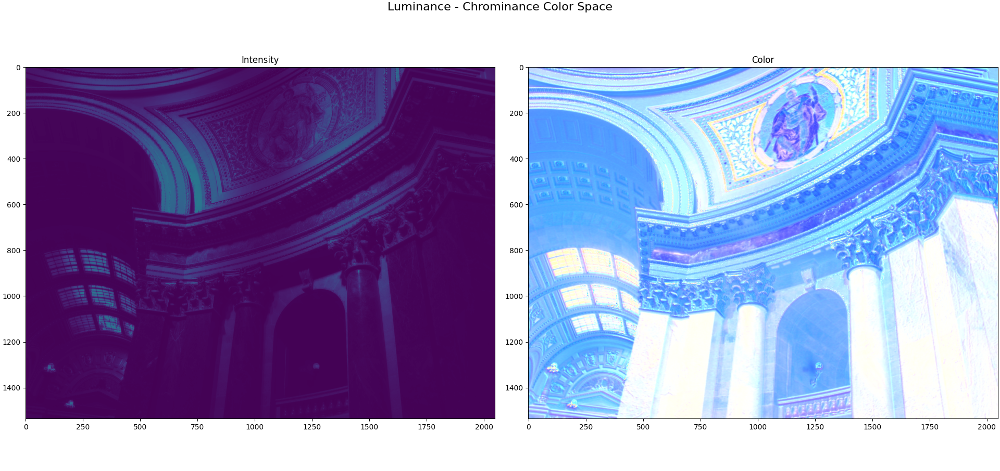
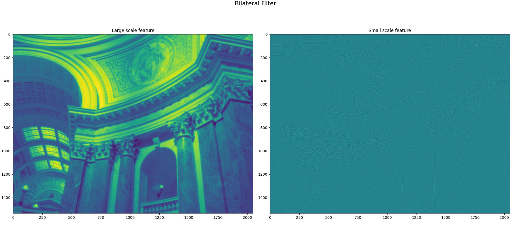
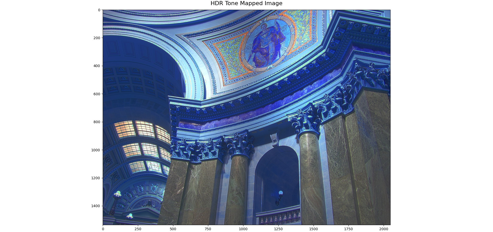

# HDR-tone_mapping
Implementation of paper "Fast bilateral filtering for the display of high-dynamic-range images"

This repository is part of the *Computational Imaging* course at DGIST.

# Steps

1) First different exposure images were combined using OpenCV to obtain merged image.

2) From the merged image "intensity" and "color" layers were calculated.

3) Bilateral filter was applied on the log10 of "intensity" image using OpenCV to obtain base layer (large-scale features) and detail layer (low scale features).

4) Two parameters named compression factor and absolute log scale was calculated using base layer. These parameters are used for performing tone mapping on base layer.

5) After tone-mapping base and detail layers are combined with color layer to produce tone-mapped image. 

# Acknowledgement:
For this assignment, following resources were quite helpful:

1. (http://people.csail.mit.edu/fredo/PUBLI/Siggraph2002/ )
2. (https://sites.google.com/site/ianschillebeeckx/cse555/hmwk1 )
